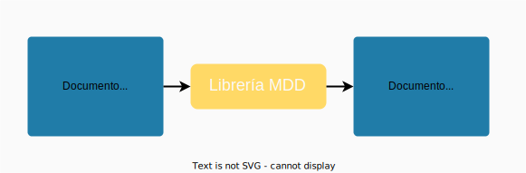
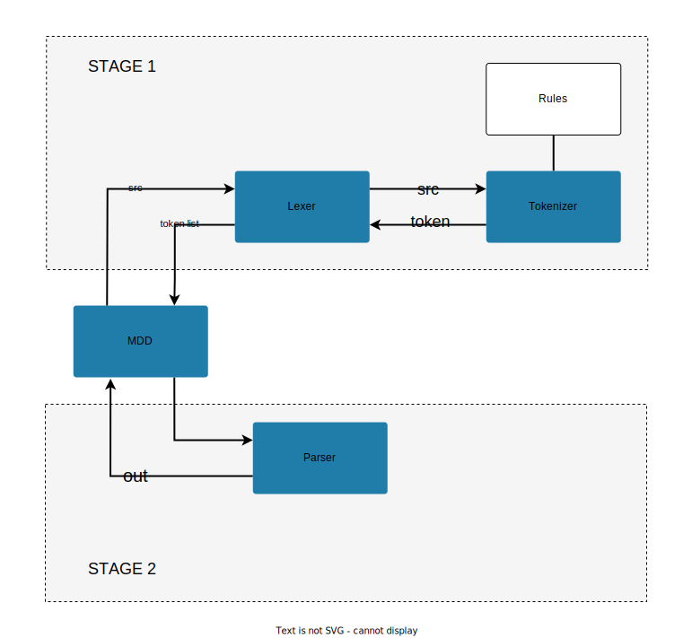

# Librería MDD. Parser md to html

MDD es una librería que transcribe un documento MD a un documento HTML. El objetivo del proyecto es facilitar la producción de páginas web estáticas y que los escritores enfoquen su tiempo en la producción de textos. 



MDD se basa en la librería [Marked](https://github.com/markedjs/marked) creada por Christopher Jeffrey bajo la Licencia MIT.

- Acceda a la página [demo](/demo/demo.html) para ver un ejemplo de un documento html resultante. 
- Acceda al documento [sintaxis](syntax.md) para conocer la nomenclatura markdown aceptada por la librería. 


## Uso 

### Uso 1 

Para transformar un documento .md a un documento .html usar usar nuestro [parser en línea](/demo/mdd.html). 

### Uso 2

Para agregar la librería a tu página web usar nuestra librería javascript [mdd.min.js](/dist/mdd.min.js). Para llamar a la librería usa el siguiente código donde *markdown* es una variable string de la fuente a traducir. 

```
mdd.transform(markdown, 'html')

```

### Uso 3

Para correr la librería en tu computadora es necesario tener instalado node.js y usar el siguiente comando:

```
node mdd.js [nombre del documento .md] [parámetro de salida: html o latex]
```  

Ejemplo:

```
node mdd.js demo.md html
```

Por crear la librería javascript desde tu computadora se requiere browserify y ejecutar el siguiente comando. 

```
browserify mdd.js --standalone mdd > dist/mdd.min.js
```


## Diseño



El sistema está divido en dos partes. En la primera etapa, el módulo central MDD entrega el documento markdown original, el sistema descompone el documento en sus categorizables partes más pequeñas y genera a cambio una lista de tokens. Los tokens son pequeños diccionarios recursivos que contienen la información de un elemento. Por ejemplo, si analizamos el siguiente código markdown:

```
# Título

Texto **del** artículo
```

La lista de tokens resultante será:

```
0:
    type: "title"
    raw: "# Título\n"
    text: "Título"
    
1: 
    type: "paragraph"
    raw: "\nTexto **del** artículo"
    text: "Texto **del** artículo"
    tokens: 0: 
                type: bold
                raw: Texto **del** artículo
                text: del
                previous: Texto
                next: artículo
```

El módulo Lexer se encarga de organizar los tokens, no de generarlos. Lexer es el controlador que estudia y reduce poco a poco el documento original mientras apila de forma paralela la lista de tokens correspondientes que genera Tokenizer para él. Dentro de su función está analizar la recursividad del documento.

Tokenizer es un módulo simple. Recibe de Lexer un documento y devuelve el primer token que observa basado en los regex definidos en Rules. Lexer como respuesta quita del documento markdown la información de ese token y vuelve a consultarle a Tokenizer por el siguiente token del documento una y otra vez hasta finalizar.

Cuando Lexer termina de descomponer en sus partes todo el documento markdown inicial le devuelve a MDD la lista completa de tokens y MDD empieza la segunda etapa del proceso. 

En la segunda parte del proceso el módulo MDD le pasa a Parser la lista de tokens y Parser le devuelve a cambio el código HTML correspondiente. Por ejemplo, para la lista de tokens:

```
0:
    type: "title"
    raw: "# Título\n"
    text: "Título"
    
1: 
    type: "paragraph"
    raw: "\nTexto **del** artículo"
    text: "Texto **del** artículo"
    tokens: 0: 
                type: bold
                raw: Texto **del** artículo
                text: del
                previous: Texto
                next: artículo
```

Parser devuelve:

```
<h1> Título </h1>
<p> Texto <b>del</b> artículo </p>
```

Al igual que Lexer, Parser es recusivo ya que analiza todos los niveles de los tokens y para cada nivel encadena la traducción html correspondiente. 
